# Работа в консольке

## 1) Переместиться между директориями

```bash
cd ~
pwd
cd /usr
pwd
cd ..
pwd
```

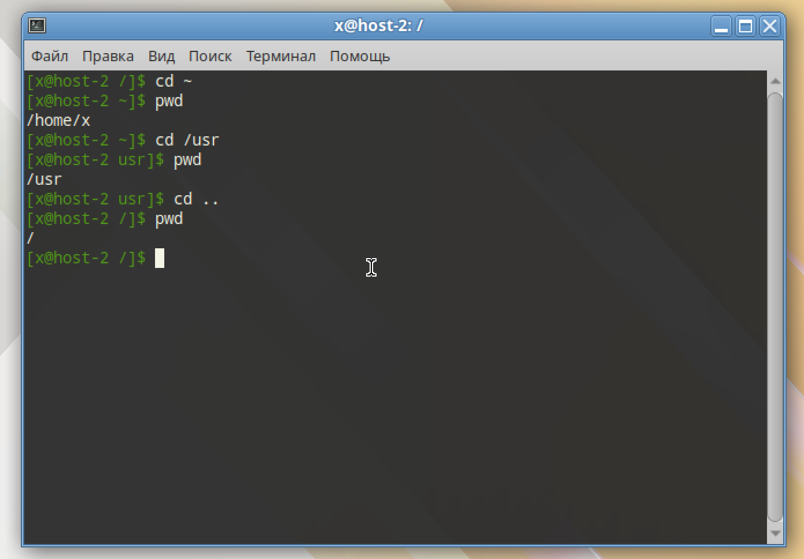

## 2) Вывести список файлов в директории

Выводим список файлов (не включая скрытые) в текущей директории в длинном формате

```
cd ~
ls -l
```

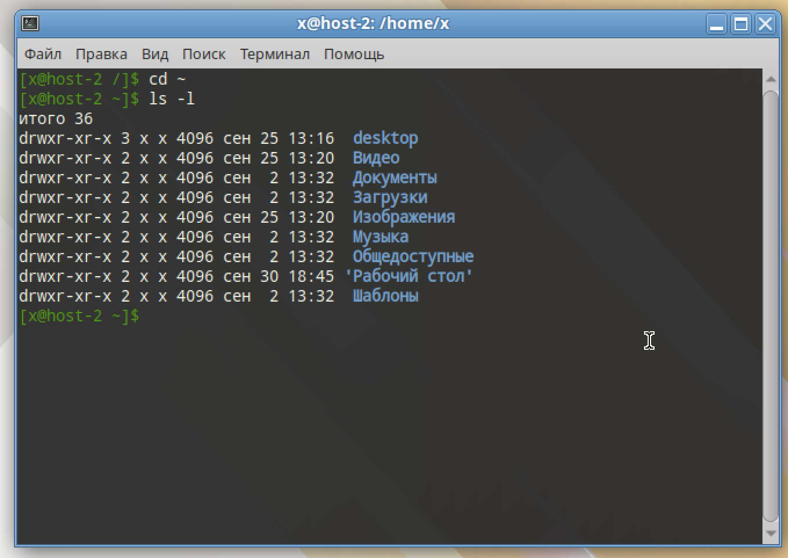

## 3) Вывести список Всех файлов в директории

```
ls -la
```

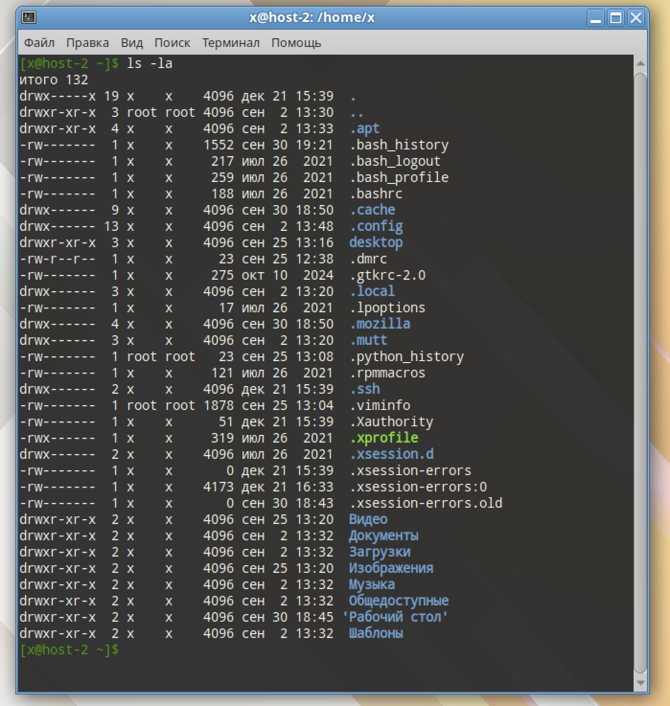

## 4) Создать папку с подпапками

```
mkdir -p smt/{in,out,temp}
ls -R smt
```

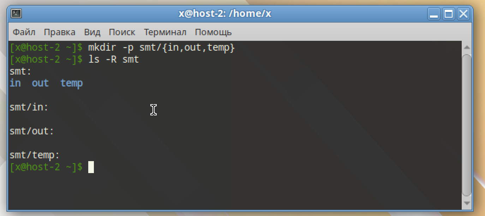

## 5) Внутри папки создать файлик и записать в него что-нибудь

```
cat > smt/in/data.txt
cat smt/in/data.txt
```

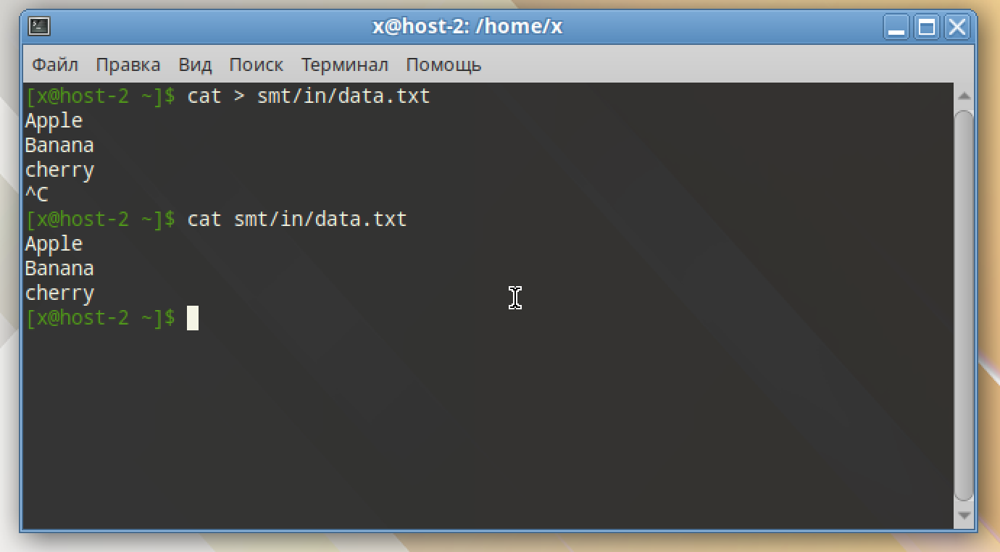

## 6) Переместить файл из одно директории в другую

```
mv smt/in/data.txt smt/temp/
ls -l smt/in
ls -l smt/temp
```

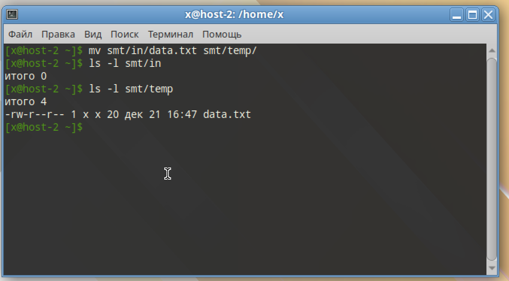

## 7) скопировать файл из одной директории в другую

Скопируем в `smt/out` под новым именем

```
cp smt/temp/data.txt smt/out/data_copy.txt
ls -l smt/out
cat smt/out/data_copy.txt
```

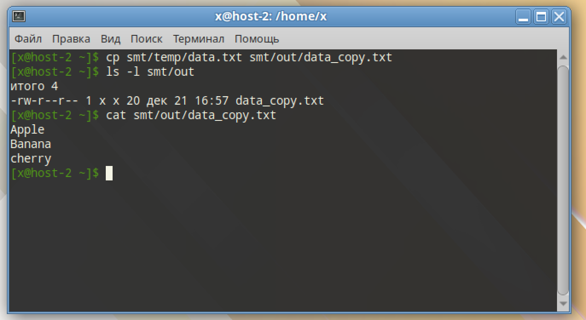

## 8) переименовать файл

Переимовываем скопированный в `smt/out` файл

```
mv smt/out/data_copy.txt smt/out/do_not_delete.txt
ls -l smt/out
```

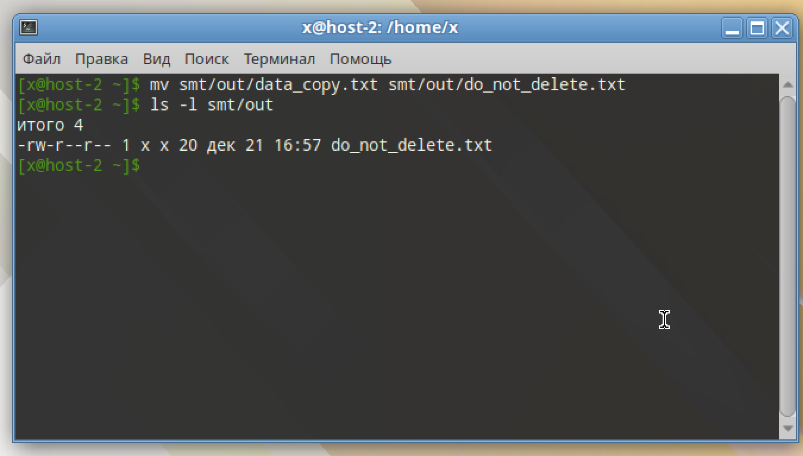

## 9) сравнить содержимое файла

Сначала сравним, изменений показать не должно

```
diff -u smt/temp/data.txt smt/out/do_not_delete.txt
```
А теперь изменим один из файлов и ещё раз сравним

```
echo "Orange" >> smt/temp/data.txt
diff -u smt/temp/data.txt smt/out/do_not_delete.txt
```

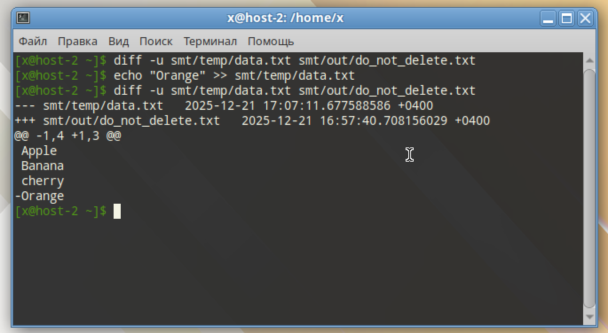

Как видно из скриншота, показывается файл-исходник `data.txt`, а потом дельта между ними (Orange нет в `do_not_delete.txt`)

## 10) отсортировать содержимоей файла по возрастанию и убыванию

Отсортируем `data.txt`. Для стабильности сортировки по байтам будем использовать `LC_ALL=C`

По возрастанию

```
LC_ALL=C sort smt/temp/data.txt
```

По убыванию (добавляем флаг `-r`)

```
LC_ALL=C sort -r smt/temp/data.txt
```

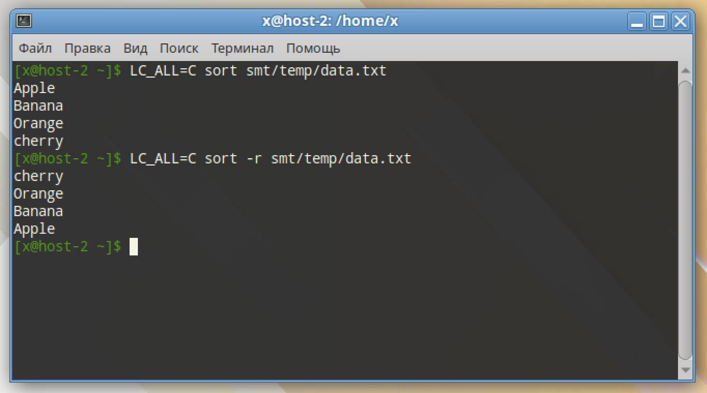

## 11) удалить все папки и файлы

Удалим `smt` полностью

```
rm -rf smt
```

И если выпадет ошибка, что такой директории нет, значит мы всё удалили

```
ls -ld smt
```

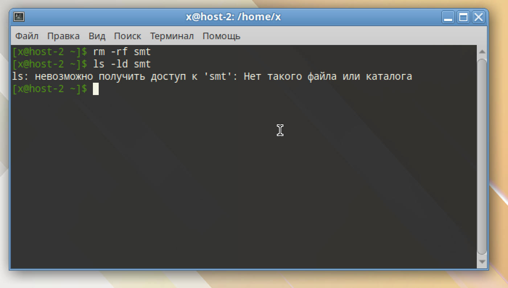