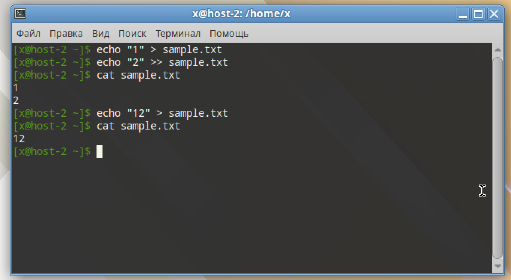
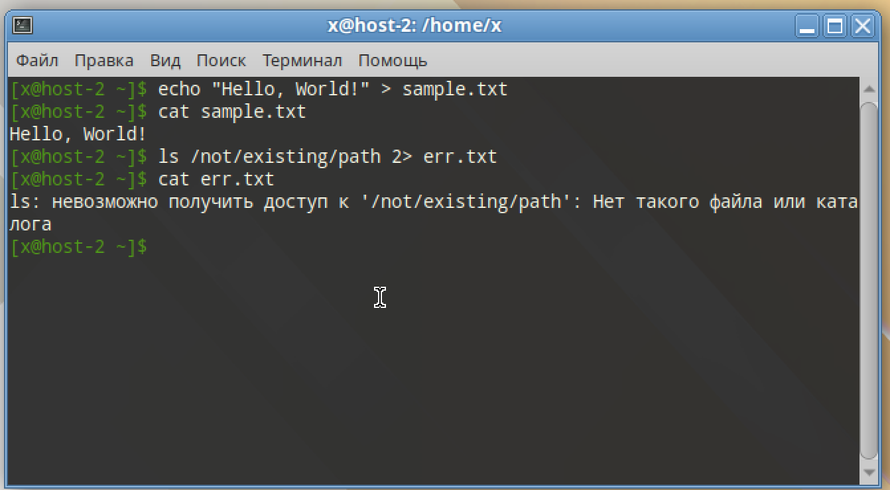
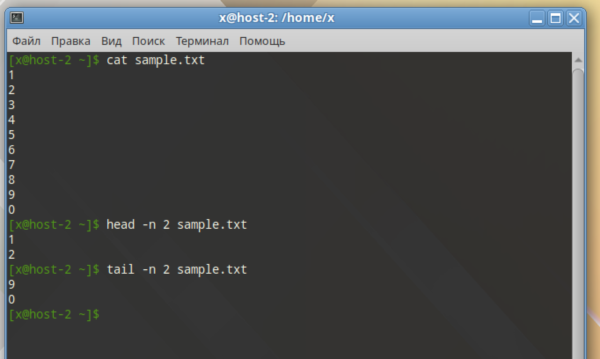
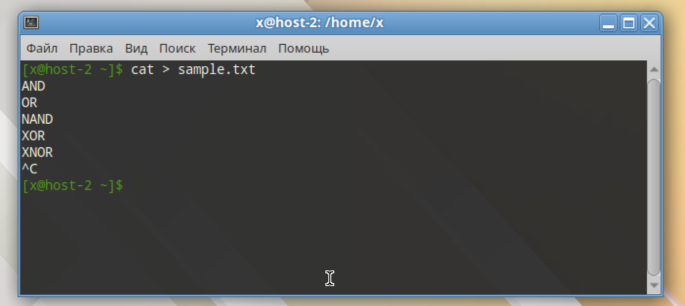
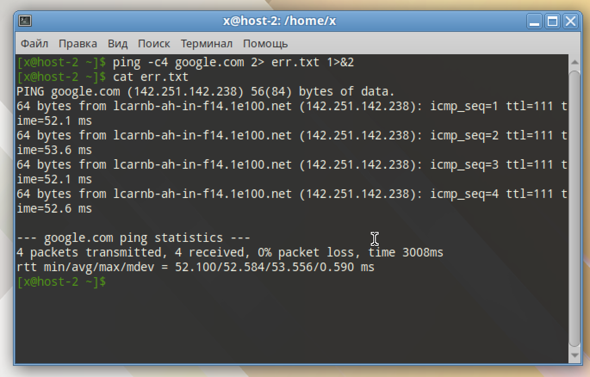
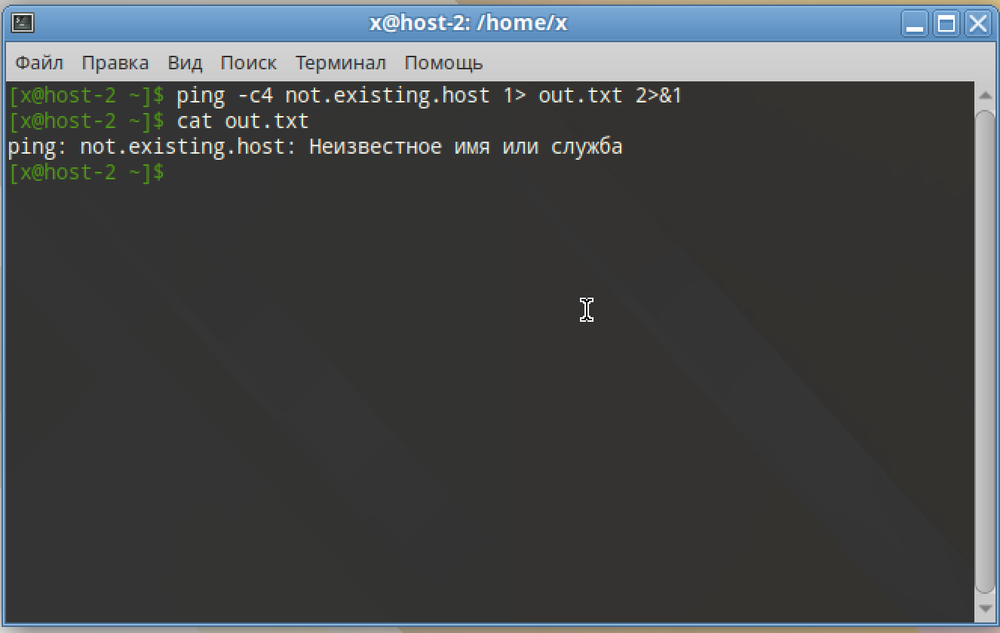
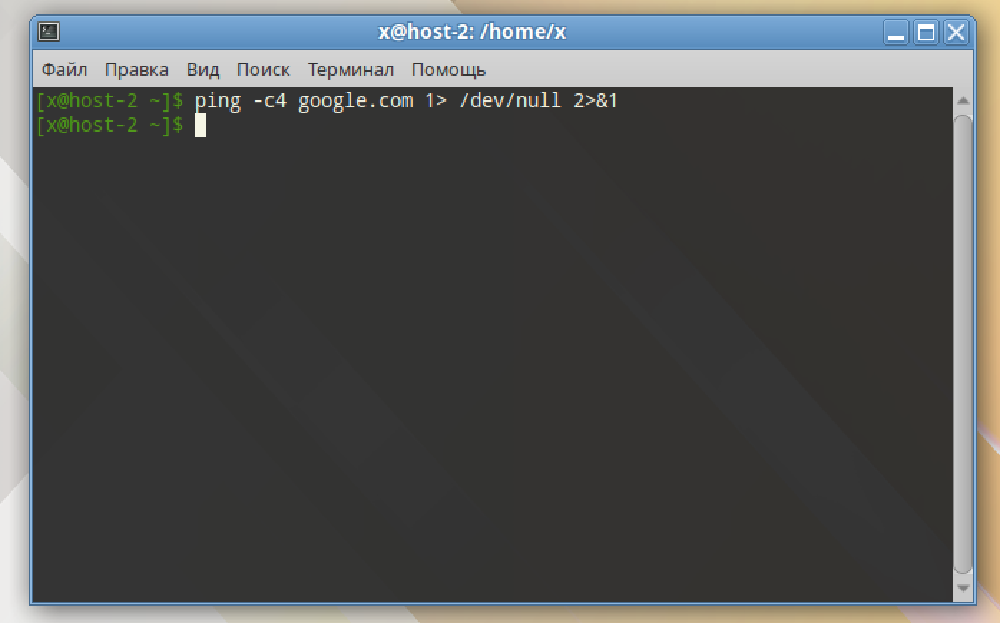

# Перенаправляем

## 1) Как работают команды >,>>?

`>` - перезапись
`>>` - дозапись

```
echo "1" > sample.txt
echo "2" >> sample.txt
echo "12" > sample.txt
``` 



## 2) Что такое перенаправление ввода? stderr,stdout;

`stdin`(0) - стандартный ввод (клавиатура/канал/файл)
`stdout`(1) - стандартный вывод (экран или другой файл)
`sterr`(2) - стандартный поток ошибок, отдельный от `stdout`

`stdout` в файл

```
echo "Hello, World!" > sample.txt
```

`stderr` в файл

```
ls /not/existing/path 2> err.txt
```



## 3) Выести содержание файла не используя текстовые редакторы;

```
cat sample.txt
```

Вывод начала и конца

```
head -n 2 sample.txt
tail -n 2 sample.txt
```



## 4) Создать файл с содержимым не используя текстовые редактор;

```
cat > sample.txt
```



## 5) пернеаправить stdout в stderr и обратно на примере команды kinit, ping, tracert

Перенаправление `stdout` в `stderr`

```
ping -c4 google.com 2> err.txt 1>&2
```




```
ping -c4 not.existing.host 1> out.txt 2>&1
```



## 6) чем отличаются stdout и stderr

`stdout` - для вывода данных программы, каких угодно. Построчная буферизация
`stderr` - для вывода диагностических сообщений программы, ошибки/логи/предупреждения. Выводятся без буферизации

## 7) что такое stdin?

`stdin` - стандартный ввод, обычно, клавиатура, но может быть файлом или pipe

## 8) как отправить весь вывод команды в пустоту?

```
ping -c4 google.com 1> /dev/null 2>&1
```


