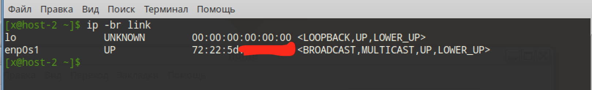
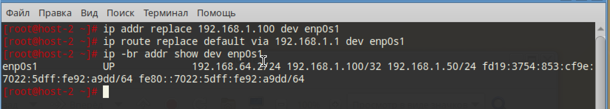
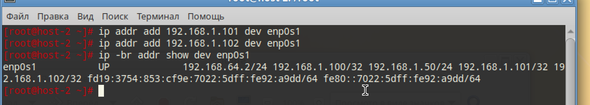
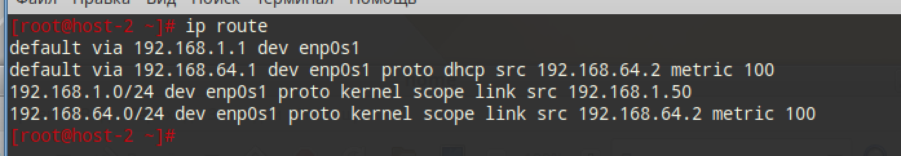
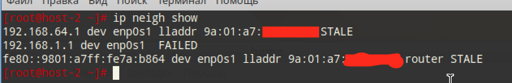

# сети

## 1. Выведите список интерфейсов, какими способами можно это сделать?

```
ip -br link
```



## 2. Попробуйте изменить ip адрес

```
ip addr replace 192.168.1.100 dev enp0s1
ip route replace default via 192.168.1.1 dev enp0s1
```

И проверим

```
ip -br addr show dev enp0s1
```



## 3. Попробуте добавить несколько ip адресов на сетевую карту

```
ip addr add 192.168.1.101 dev enp0s1
ip addr add 192.168.1.102 dev enp0s1
```



## 4. Выведите список маршрутов

```
ip route
```



## 5. Выведите arp таблицу

```
ip neigh show
```




## 6. Что такое ip адрес?

Есть 2 версии прокола IP:

IPv4: 4-х байтовая запись (192.168.0.1)

IPv6: 16 байтовая запись (2001:db8:85a3:0:0:8a2e:370:7334) (создан для увеличения диапазона IP-адресов, но придумали NAT :) )

## 7. Для чего нужны маршруты?

Показывают, куда отправлять пакеты: локально или через шлюз

## 8. Что за протокол arp?

Address Resolution Protocol - это таблица, которая делает alias IPv4 адреса с MAC-адресом устройства пределах широковещательного домена

## 9. Что такое dhcp?

Dynamic Host Configuration Protocol - динамическая выдача параметров устройству в сети: IP, маска, шлюз итд

## 10. Что такое dns?

~~Магазин техники~~ Domain Name System - записная книжка интернета. Превращает запрос доменного имени в IP-адрес и обратно. Например: `google.com` в `142.251.1.101`

## 11. Как называется один из протоколов синхронизации времени?

NTP - Network Time Protocol

## 12. Что такое широковещательный запрос, зачем он нужен?

Это сообщение, отправляемое всем узлам в пределах широковещательного домена (L2-сегмента)

Нужен для обнаружения соседей или служб, когда MAC-адрес или сервер неизвестен.

## 13. Какой адресс является широковещательным?

Для конкретной IPv4-подсети - адрес, где хостовая часть все единицы (например: для 192.168.1.0/24 - 192.168.1.255)

Специальный ограниченный широковещательный - 255.255.255.255.

## 14. Какие ещё параметры можно задать сетевой карте?

Можно задать адресацию, можно задать на канальном уровне MTU, MAC-адрес, включить-выключить адрес, скорость соединения итд

## 15. Что такое маска подсети? зачем она нужна?

Маска подсети (например: 255.255.255.0 или префикс /24) определяет, какая часть IP-адреса - сеть, а какая - хост. Нужна для: определения локальности узлов (надобность в шлюзе), вычисления широковещательного адреса и размера подсети, выбора маршрута