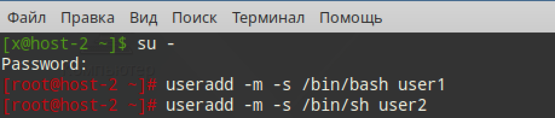
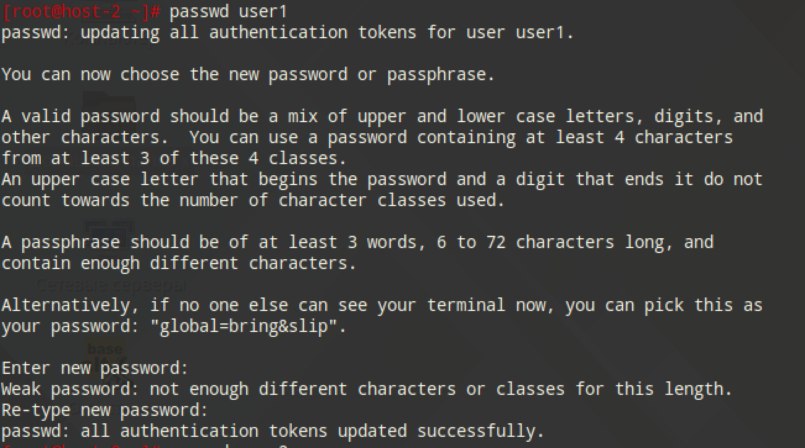
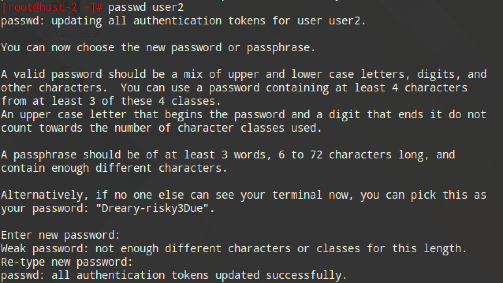
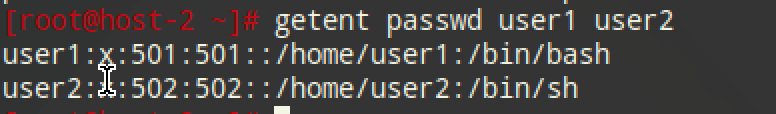
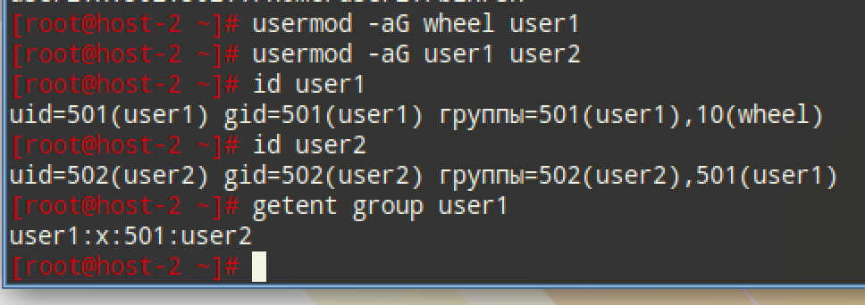
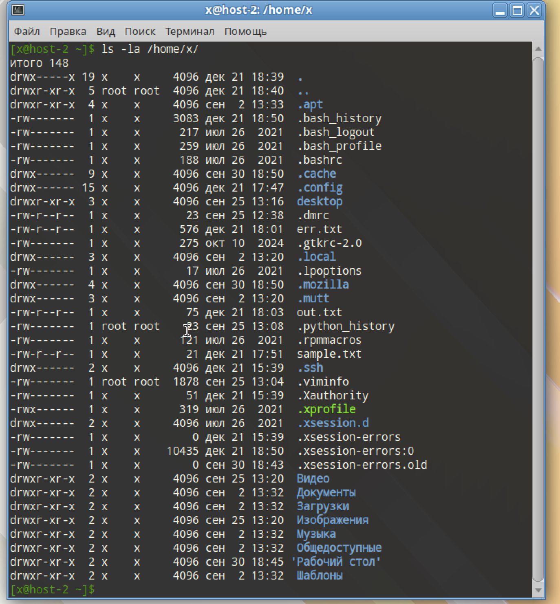
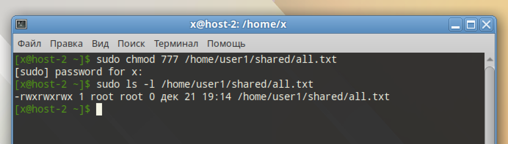
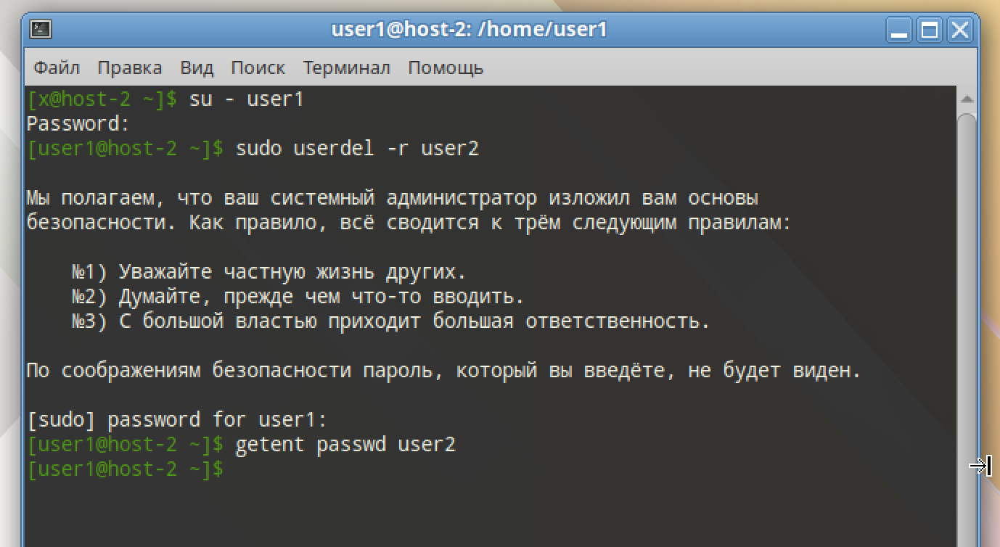
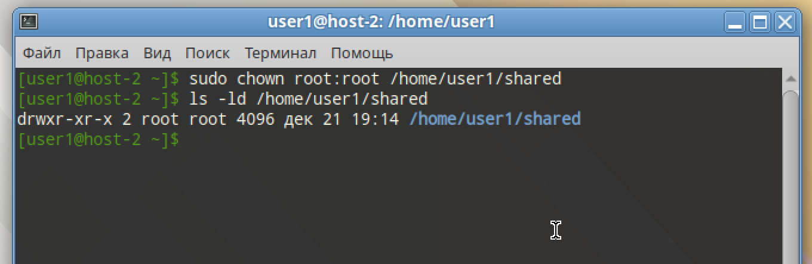

# Управление пользователями

## 1) Добавьте пользователей user1 и user2:

### 1.1) user1 - оболочка bash

Сначала входим в режим супер-пользователя (ОБЯЗАТЕЛЬНО С МИНУСОМ!!!)

```
su -
useradd -m -s /bin/bash user1
```

### 1.2) user2 - оболочка sh

```
useradd -m -s /bin/sh user2
```



### 1.3) установите им пароли

```
passwd user1
passwd user2
```




Смотрим, правильно ли создались пользователи



## 2) Назначьте пользователю 1 группу администраторов, польователя 2 добавте в группу пользователя 1

```
usermod -aG wheel user1
usermod -aG user1 user2
```



## 3) Что такое права доступа? Выведите права доступа на файлы в директории пользователя

Каждый объект имеет владельца, группу и набор прав для группы и/или прользователя

Показать права

```
ls -la /home/x/
```



## 4) Как изменить права на файлы? Создайте файл который будет на который у всез пользователей будут все возможные права

Команда `chmod 777` назначает полные права на чтение, запись и выполнение для владельца, группы и всех остальных пользователей к указанному файлу или каталогу

```
sudo chmod 777 /home/user1/shared/all.txt
```

Проверим наличие

```
sudo ls -l /home/user1/shared/all.txt
```
(мне пришлось перелопатить половину sudoers, чтобы я смог это сделать, страшный ужас...)


## 5) Как называется учётная запись встренного администратора в linux?

root

## 6) Как выполнить команду от имени администратора?

-`sudo <команда>` - если пользователь в группе `wheel` и `sudoers` настроен верно

-`su -c <команда>` - выполнить одну команду от root

-`su -` - вход под рутом

## 7) Есть ли ограничения у суперпользователя?

Практически нет ограничений. Кроме случаев, когда файловая система read-only, или параметры ядра или безопасности запрещают конкретное действие

## 8) Удалите пользователя 2 с помощью пользователя 1.

Сначала входим под user1

```
su - user1
```

Удаляем


```
userdel -r user2
```

Смотрим наличие

```
getent passwd user2
```




## 9) Как можно изменить владельца папки? измените владельца папки из пункта 4

```
sudo chown root:root /home/user1/shared
```



