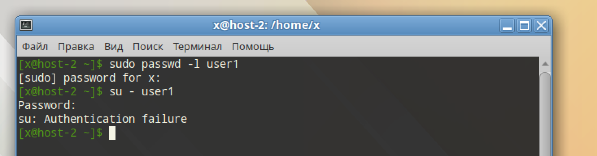
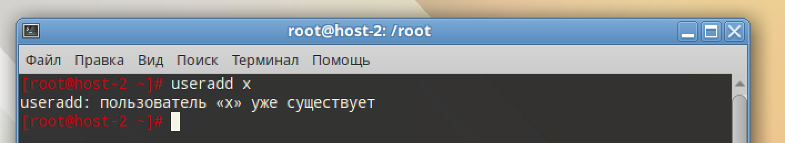

# Запрещаем

## 1. Запретите пользователю user1 из предыдщуего задания выполнять вход в систему

```
sudo passwd -l user1
```



## 2. Как вы это сделали?

`passwd -l user1` - значит заблокирован пароль для входа в учётку

## 3. Какие ещё способы это сделать вы знаете?

- `usermod -L user1` - это аналог `passwd -l user1`
- `usermod -s /bin/false` - оболочка с "тихим" отказом
- `chage -E 1970-01-01 user1` - учётная запись истекла

## 4. Можно ли создать пользователей с одинаковыми username?

Нет, username уникальны. Создание того-же username выдаст ошибку


