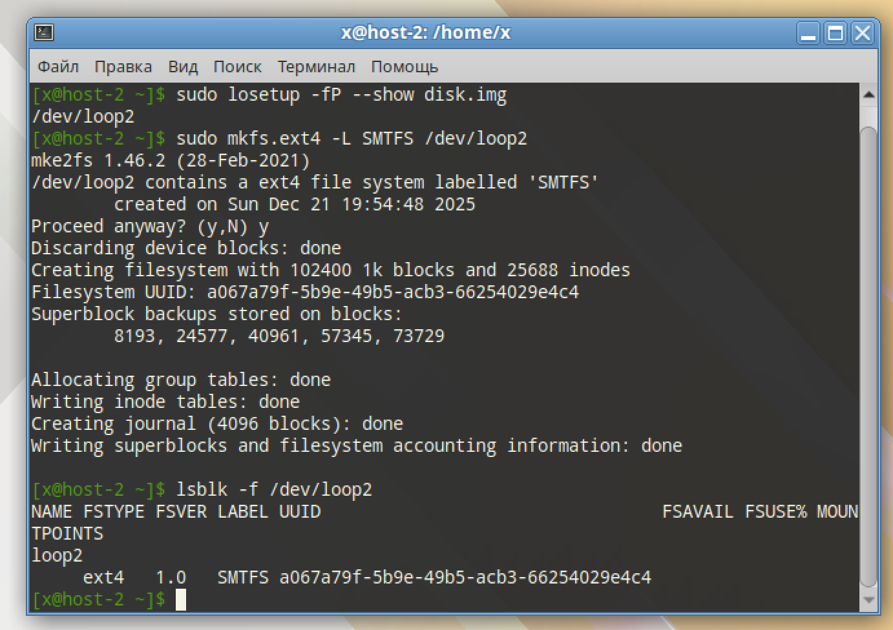
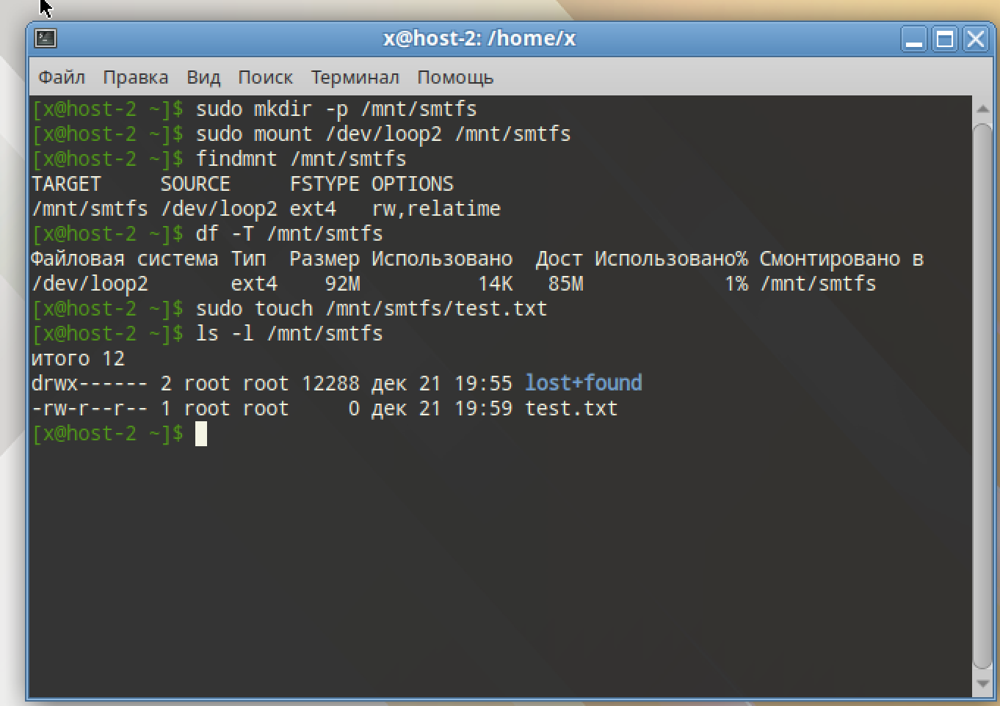
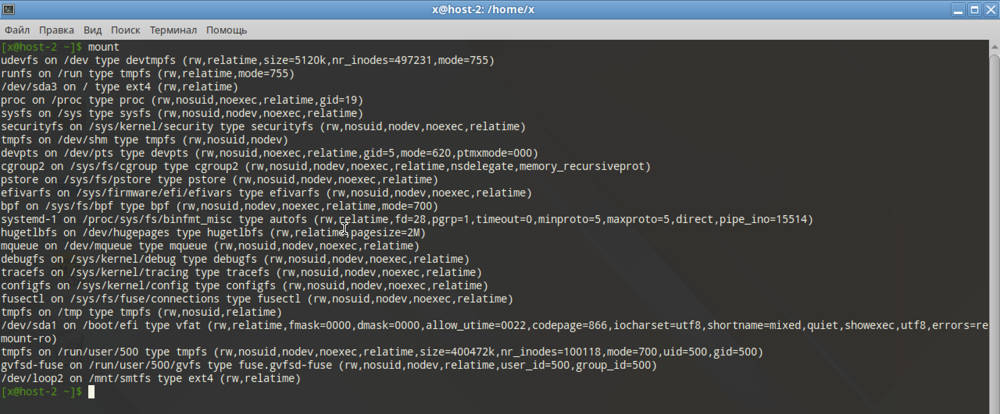
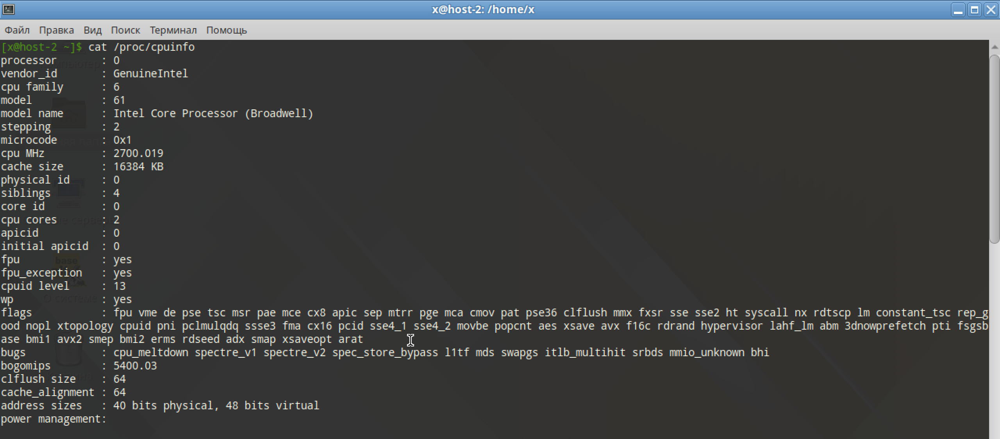
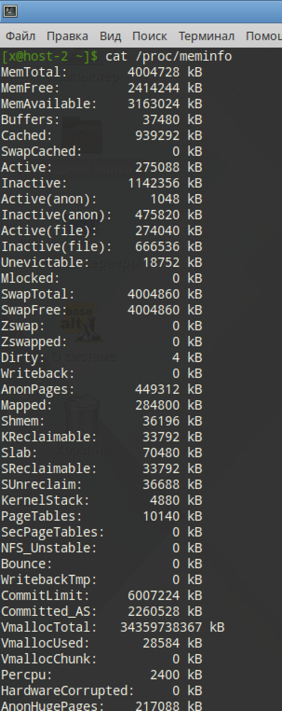

# ФС

## 1) Какие файловые системы вы знаете?

- На дисках: ext2/3/4, XFS, NTFS, FAT32, APFS, Btrfs
- Виртуальные (в памяти или ядре): proc, sysfs, tmpfs, ramfs, devtmpfs
- Образы: ISO, UDF, DMG

## 2) Как можно классифиировать файловые системы? в чём отличия??

- По месту использования: физические, сетевые, виртуальные, образные
- По архитектуре: журналируемые (ext4, APFS), не журналируемые (ext2), снимки (snapshot) (Btrfs, ZFS)
- По носителю: HDD, SSD, для флеш-памяти (exFAT), RAM (tmpfs, ramfs)

Из отличий выделяют журналируемость, его тип, поддержку снимков, возможности построения RAID-массива, поддержку ядра и сжатия

## 3) Какие файловые системы используются в linux?

- ext4: используется по умолчанию в современных дистрибутивах
- XFS: масштабируемая ФС для серверов и дата-центров
- Btrfs: современная ФС с поддержкой RAID и снимков
- procfs, sysfs, tmpfs: Служебные ФС для работы с ядром и временного хранения в ОЗУ 

## 4) Как можно создать файловую систему на диске?

```
fallocate -l 100M disk.img
sudo losetup -fP --show disk.img
sudo mkfs.ext4 -L SMTFS /dev/loop2
lsblk -f /dev/loop2
```

Создали в `loop2` ext4 раздел на 100 МБ



## 5) Как можно подключить диск в систему, что такое монтирование?

Монтирование - присоединение ФС к каталогу mountpoint в едином дереве

Процесс монтирование нашего нового ext4 диска в систему

```
sudo mkdir -p /mnt/smtfs
sudo mount /dev/loop2 /mnt/smtfs

findmnt /mnt/smtfs
df -T /mnt/smtfs

sudo touch /mnt/smtfs/test.txt
ls -l /mnt/smtfs
```



## 6) файловая система procfs, cifs, tpmfs,sysfs. В чём особенности каждой из них?

- procfs: виртуальная ФС ядра с информацией о процессах и системе
- cifs: сетевой доступ к SMB, Windows, Samba
- tmpfs: ФС в ОЗУ/swap, использует память динамически
- sysfs: представление устройств или драйверов

### Вывести каталоги к которым примонтированы эти файловые системыю

procfs смотниторвана в /proc
cifs - сетевой каталог, смонтирован обычно в /mnt или /media
tmpfs смонтирована в /tmp
sysfs смонтирована в /sys



## 7) Как можно получить информацию о системе используя лишь команду cat?


- /etc/os-release — сведения о дистрибутиве.
- /proc/cpuinfo — сведения о CPU.
- /proc/meminfo — сведения о памяти.
- /proc/uptime — время работы системы.
- /proc/loadavg — средняя нагрузка.
- /proc/cmdline — параметры загрузки ядра.
- /proc/partitions — разделы.
- /proc/swaps — подключённые swap-устройства.

### вывести ифонмацию о процессоре и состоянии памяти системы

```
cat /proc/cpuinfo
cat /proc/meminfo
``` 



