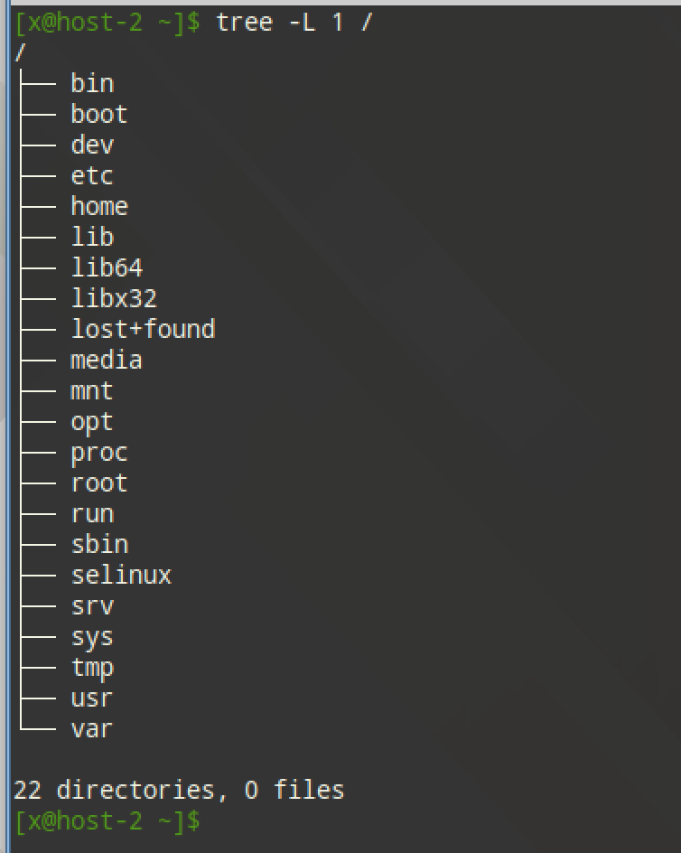

# Струтура каталогов

## 1) Какая структура каталогов в linux? выведите список файлов в корне системы

- /bin: базовые команды для всех пользователей
- /boot: загрузчик и ядро
- /dev: устройства
- /etc: конфигурация системы
- /home: домашние каталоги пользователей
- /lib, /lib64, /libx32: общесистемные библиотеки
- /media, /mnt: точки временного/съёмного монтирования
- /opt: сторонние приложения
- /proc: виртуальная ФС ядра (процессы или параметры)
- /root: домашний каталог суперпользователя
- /run: временные рантайм-данные
- /sbin: базовые команды администрирования
- /srv: данные сервисов
- /sys: виртуальная ФС устройств или драйверов
- /tmp: временные файлы
- /usr: "пользовательские" приложения и данные (неизменяемая часть)
- /var: изменяемые данные (логи, очереди, кэш)

```
tree -L 1 /
```



## 2) Где хранятся папки пользователей в системе?

Домашние каталоги хранятся в `/home/<имя пользователя>`

## 3) Где домашняя папка суперпользователя?

`/root`

## 4) Где хранятся основые конфигурационные файлы в системе?

`/etc`

## 5) ЧТо за папки /bin,/sbin,usr/sbin,/usr/sbin

- /bin: базовые пользовательские утилиты, нужные в однопользовательском режиме (sh, ls, cp, mv, cat).
- /sbin: базовые системные утилиты для администраторов.
- /usr/bin: остальной (необязательный для ранней загрузки) пользовательский софт.
- /usr/sbin: остальной админский софт.
