# Продолжаем

## 1. Выведите содержимое fstab. Что хранится в fstab?

Файл `/etc/fstab` описывает постоянные точки монтирования, что монтировать и куда

```
cat /etc/fstab
```

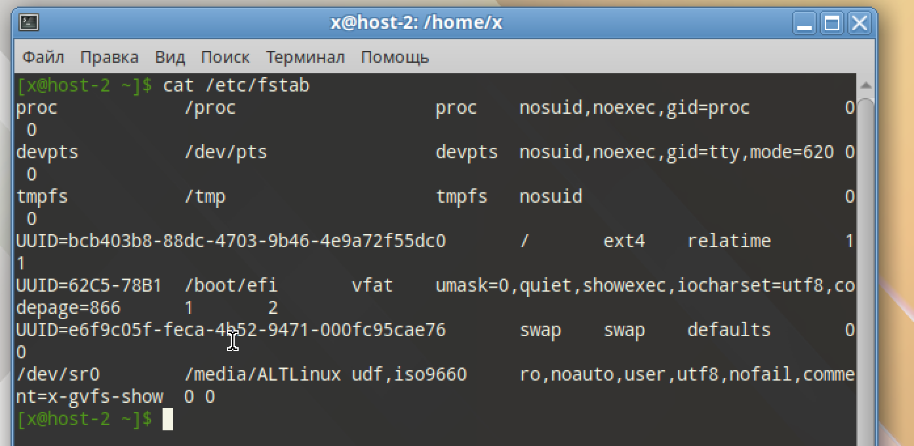


## 2. Добавьте в виртуальную машину ещё один диск

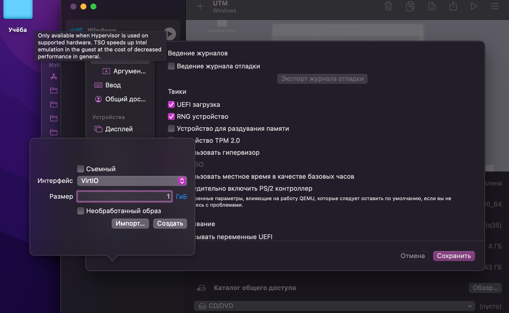

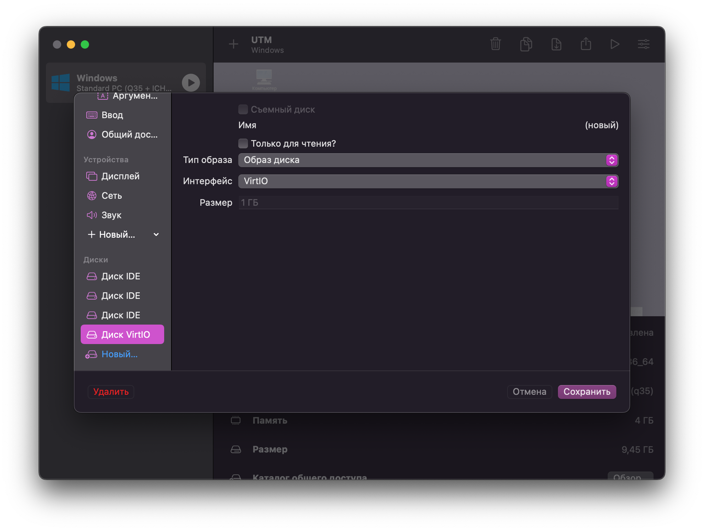

## 3. Узнайте как ситема видит ваш диск - выведите информацию о блочных устройствах

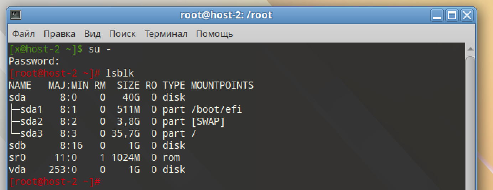

Добавленный диск: /dev/vda

## 4. С помощью полученной информации создайте на диске таблицу разделов и фаловую систему ext4

```
parted -s /dev/vda mklabel gpt
parted -s /dev/vda mkpart primary ext4 100MiB 100%
partprobe /dev/vda
mkfs.ext4 -L DATA /dev/vda

lsblk -f /dev/vda /dev/vda1
```

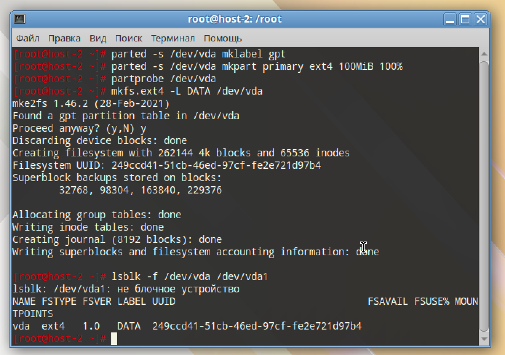


## 5. Примонитруте диск в каталог /mnt

```
mkdir -p /mnt
mount /dev/vda /mnt

findmnt /mnt
```

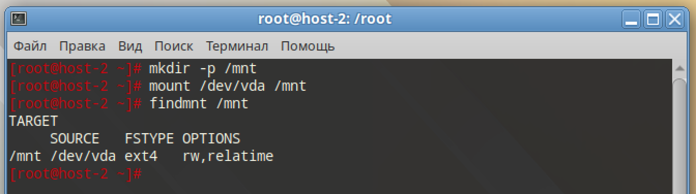

## 6. Зайдите в каталог и создайте там файлы

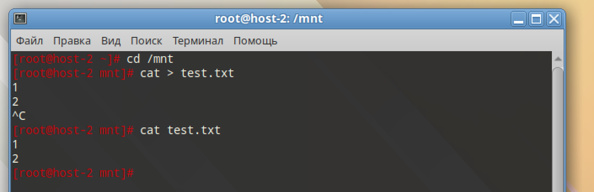

## 7. Отмонтируйте диск и проверье остались ли файлы

```
umount /mnt
ls -la /mnt
mount /dev/vda /mnt
ls -lh /mnt
```

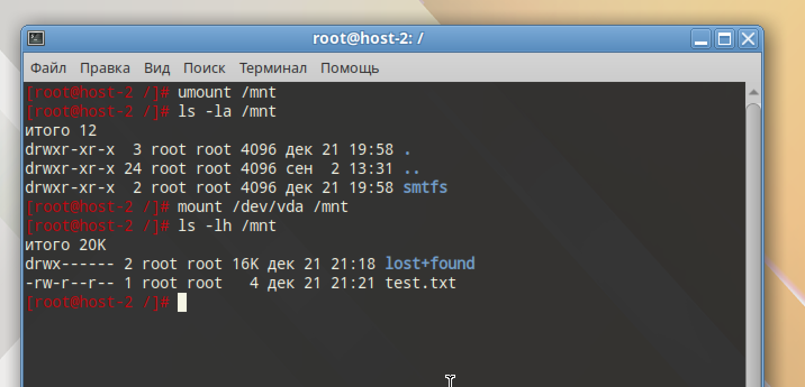

## 8. Сделайте так чтобы диск автоматически подключался при загрузке систем ( добавьте информацию о нём с fstab)

```
UUID=$(blkid -s UUID -o value /dev/vda)
echo "UUID=$UUID /mnt ext4 defaults,nofail 0 2" | tee -a /etc/fstab
```

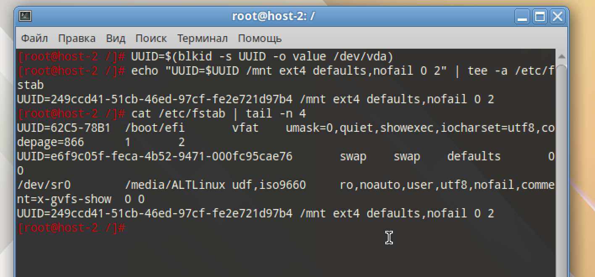

## 9. Проверьте корретность записанных в fstab данных перед перезагрузкой

```
umount /mnt 2>/dev/null
mount -av
findmnt /mnt
```

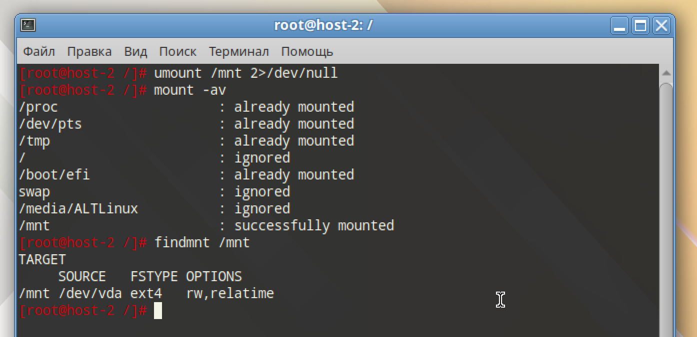

## 10. Перезагрущите систему и убедитесь что диск был подключён к системе

```
findmnt /mnt
```

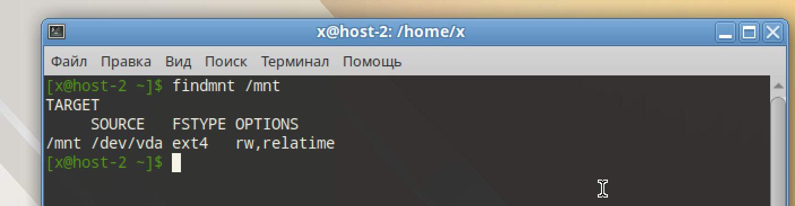
