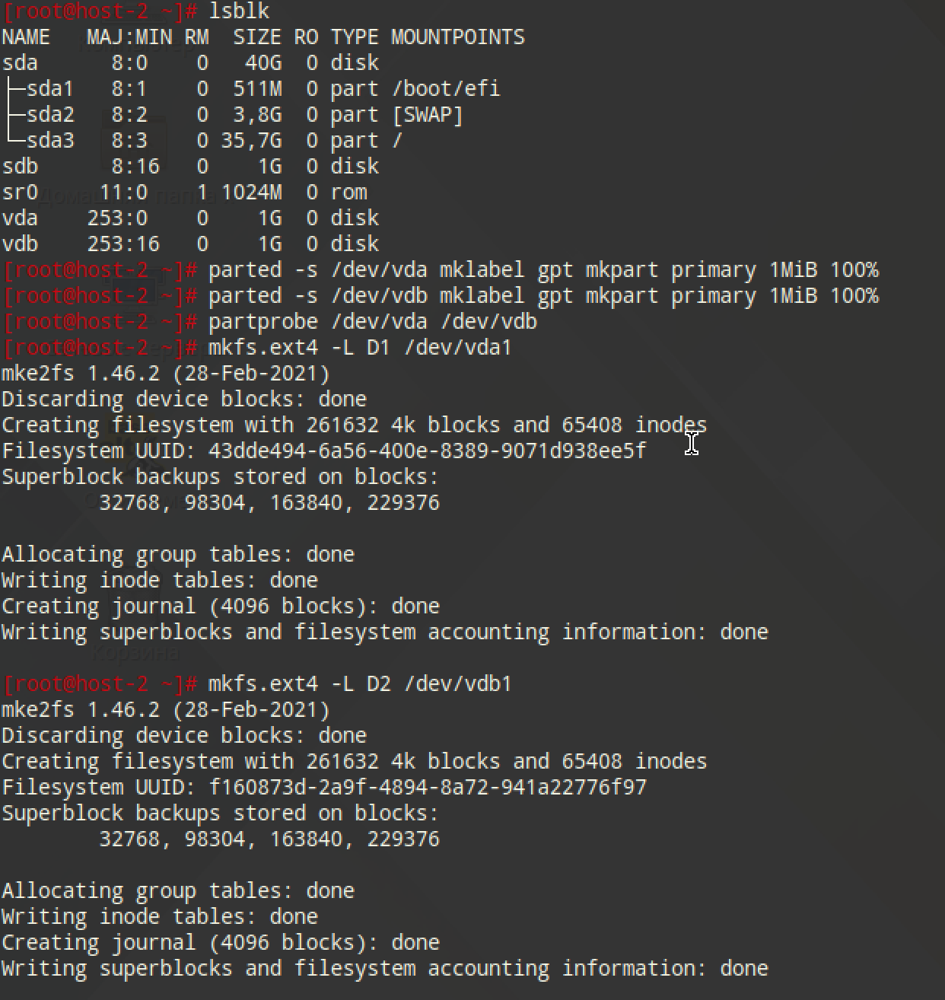
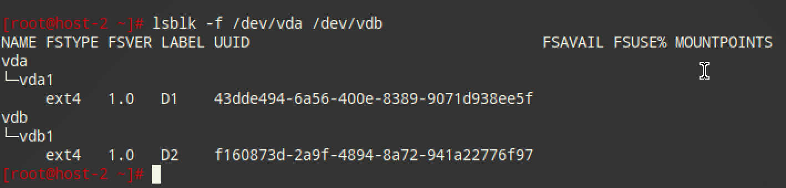
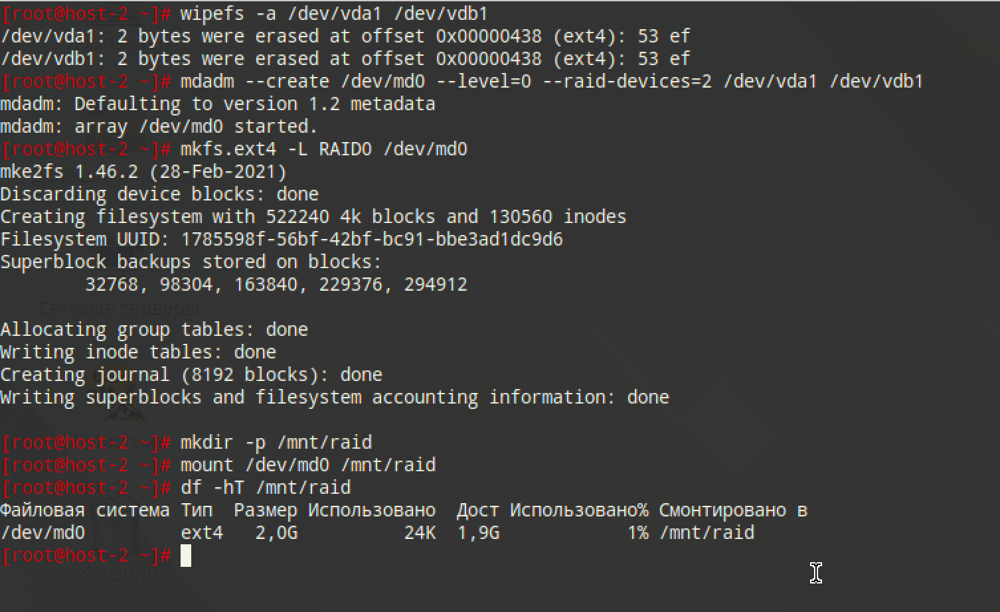
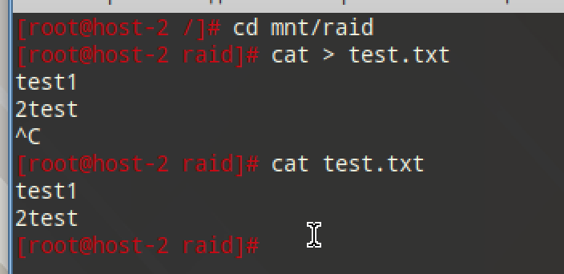
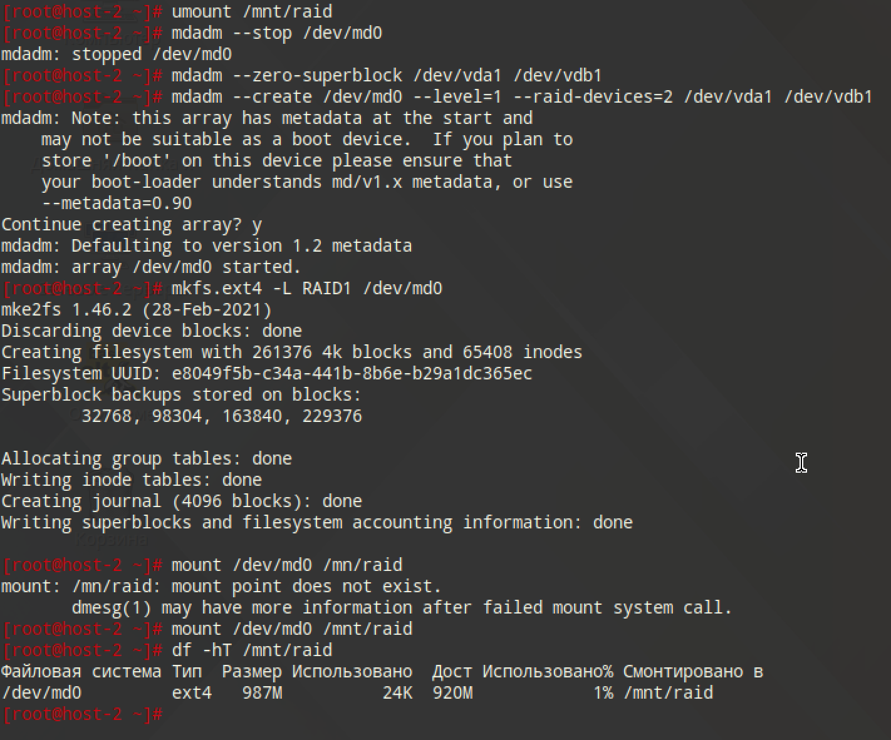

# Продолжаем

## 1. Raid массивы, что такое икакие бывают

RAID (Избыточный массив независимых дисков) - объединение нескольких дисков ради ускорения и/или улучшения отказоустойчивости (НО НЕ РАДИ БЕКАПОВ, ОНИ НЕ ДЛЯ ЭТОГО)

Бывают разные методы создания RAID:

- Аппаратный: сть контроллер на плате, который как раз сам управляет какие данные куда отправлять
- Программный: Система на уровне ядра подключает драйвера и сама решает как и куда отправлять данные, перекладывая эту задачу на процессов
- Аппаратно-програмный: Часто замечается в BIOS под видом Intel Rapid Storage techology или наподобие. На самом деле никакого отдельного RAID-контроллера нет, просто BIOS на этапе передачи загрузки системе сообщает ядру, что такие-то диски подключены в RAID, и должны работать именно таким образом. Т.е. это более удобное создание RAID массивов, но по итогу вся работа всё равно на процессоре

Уровни RAID:

- RAID 0: (минимум 2 диска) чередование блоков. Увеличивает операции скорость/чтение на диск в 2 раза. Отказоустойчивость нулевая, ломается 1 диск из массива - летит вся информация
- RAID 1: (минимум 2 диска) зеркалирование. Один из редких случаев, когда RAID - это про бекап данных. Диски - это копия друг-друга
- RAID 5: (минимум 3 диска) запись контрольных сумм, использующий чередование данных с распределенной по всем дискам контрольной суммой, что позволяет пережить отказ одного диска без потери данных, но страдает от более медленной записи

## 2. Добавьте в виртуальную машину 2 диска отформатируйте их в ext4

```
parted -s /dev/vda mklabel gpt mkpart primary 1MiB 100%
parted -s /dev/vdb mklabel gpt mkpart primary 1MiB 100%
partprobe /dev/vda /dev/vdb

mkfs.ext4 -L D1 /dev/vda1
mkfs.ext4 -L D2 /dev/vdb1
lsblk -f /dev/vda /dev/vdb
```




## 3. Создайте из них raid 0 массив

```
wipefs -a /dev/vda1 /dev/vdb1
mdadm --create /dev/md0 --level=0 --raid-devices=2 /dev/vda1 /dev/vdb1

mkfs.ext4 -L RAID0 /dev/md0
mkdir -p /mnt/raid
mount /dev/md0 /mnt/raid
df -hT /mnt/raid
```



## 4. Проверье всё ли работает



## 5. Удалите raid0 и создайте raid1

```
umount /mnt/raid
mdadm --stop /dev/md0
mdadm --zero-superblock /dev/vda1 /dev/vdb1

mdadm --create /dev/md0 --level=1 --raid-devices=2 /dev/vda1 /dev/vdb1
mkfs.ext4 -L RAID1 /dev/md0
mount /dev/md0 /mnt/raid
df -hT /mnt/raid
```



## 6. В чём между ними разница?

- RAID 0: максимальная скорость, минимальная отказоустойчивость
- RAID 1: идеальный для максимального сохранения данных, но объём будем равен одному диску

## 7. Есть ли файловые системы которые поддерживают raid массивы без стороненго ПО

Btrfs, ZFS

## 8. Можно ли создать raid массив во время установки системы?

Да, во время установки дистрибутивов Linux предлагают создать программный RAID

