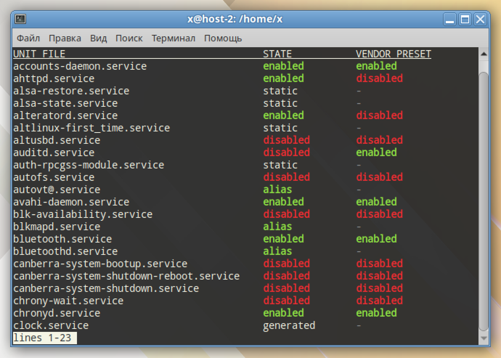
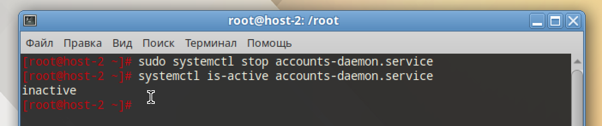
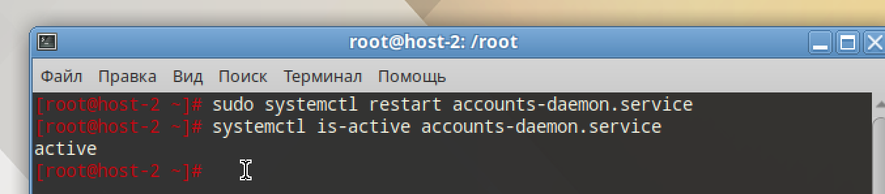
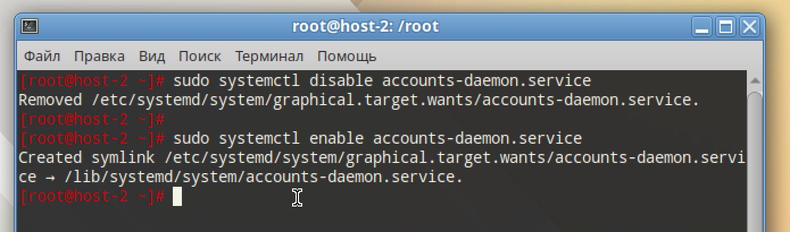

# Юниты

## 1. Что такое systemd юнит?

Юнит - объект systemd. Описание служб, например, таймера, точек монтирования итд. Хранится в `.service`,`.timer`,`.mount`,`.socket`,`.target`,`.path`

## 2. Проверье статус любого systemd юнита, какую информацию выводит эта кманда?

```
systemctl list-unit-files --type=service
```



## 3. ПОпробуйте оставновить сервис.

```
sudo systemctl stop accounts-daemon.service

systemctl is-active accounts-daemon.service
```



## 4. Перезапустите его.

```
sudo systemctl restart accounts-daemon.service

systemctl is-active accounts-daemon.service
```



## 5. УДалите из автозагрузки

```
sudo systemctl disable accounts-daemon.service
```

## 6. Верните обратно

```
sudo systemctl enable accounts-daemon.service
```



## 7. Что такое таймеры?

Таймеры - планировщики systemd. Они запускают `.service` по расписанию. Могут запускать по какому-либо событию (OnBootSec итд). Могут запускать по календарному расписанию