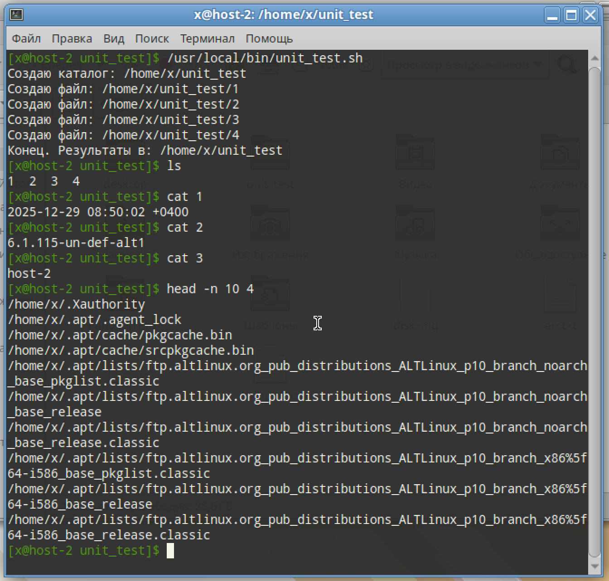
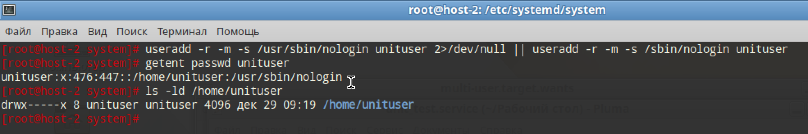

# Пишем юниты

## 1. Создайте скрипт который создаёт папку заполняет её файлами ( имена 1-4 ) и записывает в них информацию о текущей дате, версии ядра, имени компьютера и списе всех файлов в домашнем каталоге пользователя от которого выполняется скрипт( не забудьте сдлеать проверку на существование файлов и папок)

```
#!/bin/bash
set -euo pipefail
IFS=$'\n\t'

USER_HOME="$HOME"

cd "$USER_HOME"

TARGET_DIR="$USER_HOME/unit_test"

# Проверка а также создание каталога
if [ -d "$TARGET_DIR" ]; then
echo "[WARN] Каталог уже существует: $TARGET_DIR"
else
echo "Создаю каталог: $TARGET_DIR"
mkdir -p "$TARGET_DIR"
fi

# Делаем файлы-пустышки
for f in 1 2 3 4; do
p="$TARGET_DIR/$f"
if [ -e "$p" ]; then
echo "[WARN] Файл существует и будет перезаписан: $p"
else
echo "Создаю файл: $p"
: > "$p"
fi
done

# 1) текущая дата и время
date '+%F %T %z' > "$TARGET_DIR/1"

# 2) версия ядра
uname -r > "$TARGET_DIR/2"

# 3) имя компьютера (Лучше попробовать hostnamect, но если что и hostname пойд\т)
{ hostnamectl --static 2>/dev/null || hostname; } > "$TARGET_DIR/3"

# 4) список всех файлов в домашнем каталоге (рекурсивно)
# А также игнорируем возможные ошибки чтения и сортируем
LC_ALL=C find "$USER_HOME" -type f -print 2>/dev/null | LC_ALL=C sort > "$TARGET_DIR/4"

echo "Конец. Результаты в: $TARGET_DIR"
```

```
cd unit_test
ls

cat 1
cat 2
cat 3
head -n 10 4
```



## 2. Создайте юнит который будет вызывать этот скрипт при запуске. Проверьте

```
[Unit]
Description=Unit test: создать папку и файлы 1–4 в домашнем каталоге пользователя

[Service]
Type=oneshot
ExecStart=/usr/local/bin/unit_test.sh

[Install]
WantedBy=multi-user.target
```

```
systemctl daemon-reload
systemctl enable start-unit-test.service
systemctl status start-unit-test.service --no-pager
journalctl -u start-unit-test.service -n 20 --no-pager
```

## 3. Создайте таймер который будет вызывать выполнение одноимённого systemd юнита каждые 5 минут.

```
[Unit]
Description=Запуск start-unit_test.service каждые 5 минут

[Timer]
OnBootSec=1min
OnCalendar=*:0/5
Unit=start-unit_test.service
Persistent=true

[Install]
WantedBy=timers.target
```
```
systemctl daemon-reload
systemctl enable --now unit-test.timer
systemctl list-timers --all --no-pager | grep unit-lab
```

## 4. От какого пользователя вызыаются юниты поумолчанию?

От рута, если нет флага User

## 5. Создайте пользователя от имени которого будет выполняться ваш скрипт.

```
useradd -r -m -s /usr/sbin/nologin unituser 2>/dev/null || useradd -r -m -s /sbin/nologin unituser
getent passwd unituser
ls -ld /home/unituser
```



## 6. Дополните юнит информацией о пользователе от которого должен выплняться скрипт.

Добавить в [Service]

```
User=unituser
Group=unituser
WorkingDirectory=%h
```

## 7. Дополните ваш скрипт так, что бы он независимо от местоположения всега выполнялся в домашней папке того кто его вызывает.

Добавить в начало скрипта

```
if [ -n "${HOME:-}" ] && [ -d "$HOME" ]; then
USER_HOME="$HOME"
else
USER_HOME="$(getent passwd "$(id -u)" | cut -d: -f6)"
fi
```
