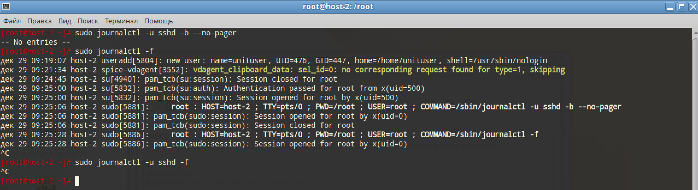

# Журнальчики

## 1. Посмотретите журналы ssh

```
sudo journalctl -u sshd -b --no-pager
```

## 2. Выведите журналы в реальном времени

```
sudo journalctl -f
```

## 3. Выведите лог в реальном времени для службы sshd

```
sudo journalctl -u sshd -f
```



Логов мало. До ssh ещё не дошёл

## 4. Можно ли без комады journalctl прочитать логи systemd?

Нет, журнал в бинарном виде

## 5. Сколько будет 2-2?

Ноль? Может тут есть peak linux humor, который я не могу понять?