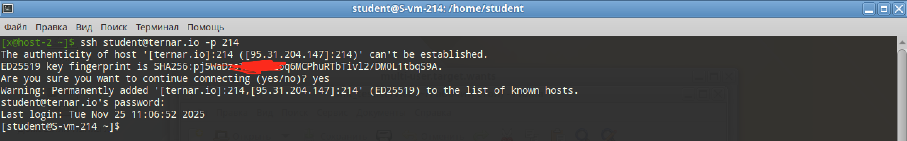
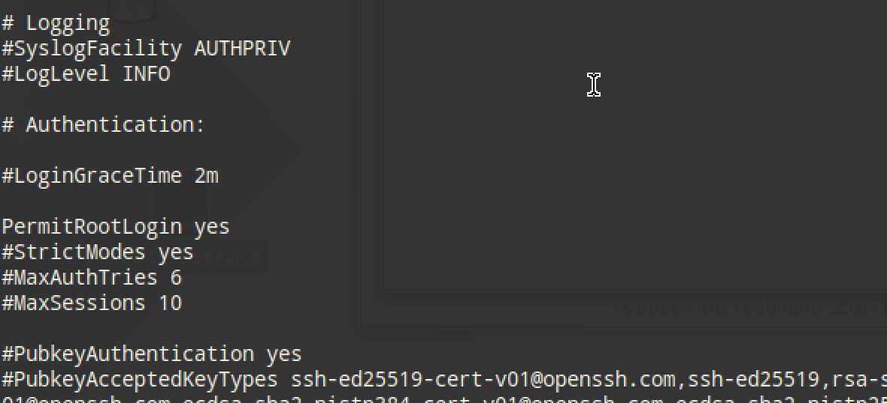
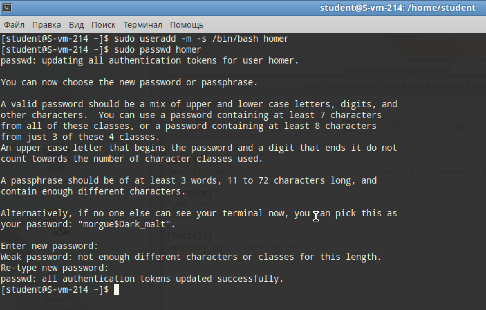
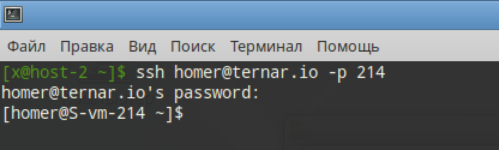
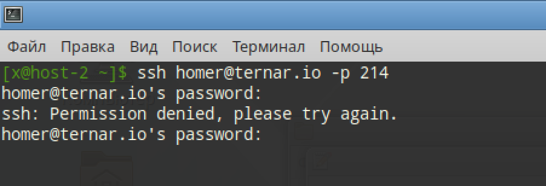

# Настриваем

А куда пропала 6 лаба?

## 1. Какой по умолчанию используется порт для поключения?

22-й порт

## 2. Можно ли его изменить? если да то как?

Флагом -p при подключении, или в sshd снять комментарий с `# Port = 2222` и вбить своё

## 3. Какая служба отвечает за обработку запросов на подключения по ssh?

sshd, который построен на OpenSSH

## 4. Какой файл конфигурации отвечает за его настройку?

`etc/ssh/sshd_config`

## 5. Попробуйте подключиться по ssh к предоставленному вам серверу

```
ssh student@ternar.io -p 214
```



## 6. Отредактируйте файл настроек на сервере так, чтобы была возможность подключиться к серверу используя пользователя root

Меняем конфиг
```
vi /etc/openssh/sshd_config
```

Меняем строчку
```
PermitRootLogin yes
```

И перезапуск
```
systemctl restart sshd
```



## 7. Измените колличество ошибок ввода пароля перед сборосом соединения, покажите эти измененения

```
vi /etc/openssh/sshd_config
```

```
MaxAuthTries 5
```

```
systemctl restart sshd
```

Тоже самое, что и предыдущий шаг, просто значение другое

## 8. Создайте пользователя ssh-user и попробуйте им подключиться к серверу

```
useradd -m -s /bin/bash homer
passwd homer
```




## 9. Ограничте ему возможность подключения к серверу

```
ssh homer@ternar.io -p 214
```



## 10. Как вы это сделали?

В конец конфига ssh добавил `DenyUsers homer`
И перезапустил `systemctl restart sshd`

## 11. Что хранится в файле known_hosts?

Файл `known_hosts` (находится в ~/.ssh/known_hosts на клиенте) хранит список публичных ключей (fingerprint) серверов, к которым клиент ранее подключался

Он нужен для идентификации сервера:

1. При первом подключении SSH спрашивает, доверяете ли вы этому хосту, и сохраняет его ключ.
2. Защита от атаки MITM (Man-in-the-Middle). Если при следующем подключении ключ сервера изменится (если сервер переустановят или кто-то попытается перехватить трафик, подменив сервер), SSH-клиент увидит несовпадение с записью в known_hosts, выдаст предупреждение и врубит kill-switch.