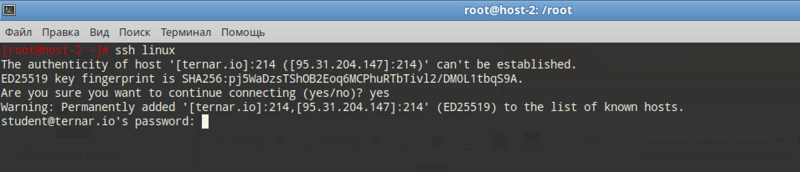

# Конфижим для удобства

## 1. Где хранятся пользвательские и системные настройки подключения?

Пользовательские: `~/.ssh/config`

Системные (для всех пользователей): `etc/openssh/ssh_config`

## 2. Что за файл options?

Находится в `~/.ssh/config`

Можно создавать псевдонимы (alias) для подключений. Чтобы вместо длинной строки `ssh ... -p 214` писать `ssh linux`

## 3. Отредактируйте файл options так, чтобы можно было подключаться не вводя имя пользвателя и порт и 4. Назовите подключение удобным для вас спсобом

```
mkdir -p ~/.ssh
vi ~/.ssh/config
```

```
Host linux
HostName ternar.io
User student
Port 214
```

## 5. Проверьте работоспособность

`ssh linux`

