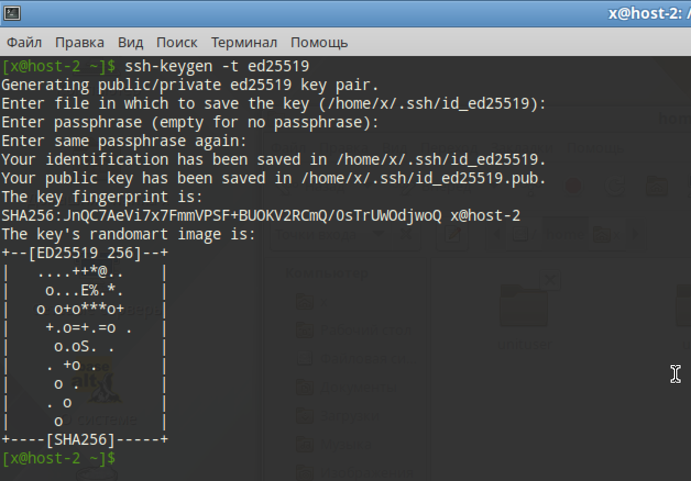
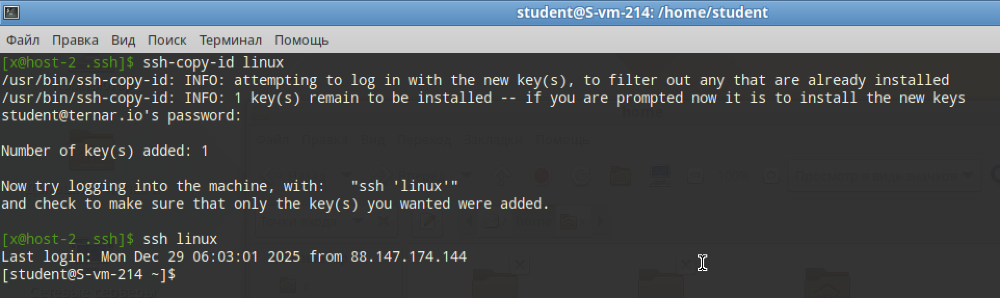

# Ключики

## 1. Что такое ssh ключи и зачем они нужны?

SSH ключи построенны на алгоритме ассиметричного шифрования SHA-256. Где есть пара открытый-закрытый ключ. Тут прямо просится аналогии с Алисой и Бобом, но лучше пропустить эту часть, иначе получится 30-страничная 'маленькая историческая справка'

Нужны они в первую очередь для аунтетификации пользователя без ввода пароля. Закрытый ключ хранится у юзера локально. А открытый ключ хранится на сервере

## 2. Как их создать? 

Создаются они при помощи `ssh_keygen`, который идёт комплектом с OpenSSH

## 3. Создайт пару публичный/приватный ключ ed_25519, где они хранятся?

```
ssh-keygen -t ed25519
```

Не использовал passphrase, чтобы всё было по дефолту



Приватный ключ хранится в `~/.ssh/id_ed25519`

Открытый хранится в `~/.ssh/id_ed25519.pub`

## 4. Скопируйте публичный ключ на ваш сервер, в каком файле он будет храниться?

Делаем вход без ввода пароля

```
ssh-copy-id linux
```

Вводим пароль последний раз и получаем вход без пароля!



## 5. Попробуйте подключиться к серверу, у вас запросили пароль?

```
ssh linux
```

Всё подключилось сразу, это радует

## 6. Запретите подключение с паролем для всех пользователей, оставьте только с помощью ключа.

Опять заходим в конфиг

```
sudo vi /etc/openssh/sshd_config
```

И меняем `PasswordAuthentication` на `no`

И перезапускаем

```
systemctl restart sshd
```