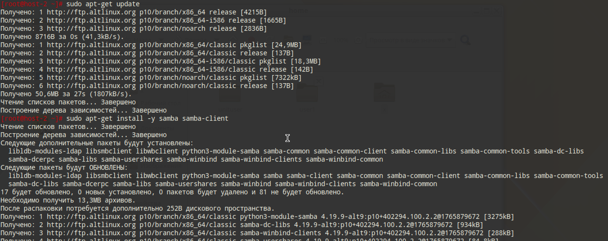
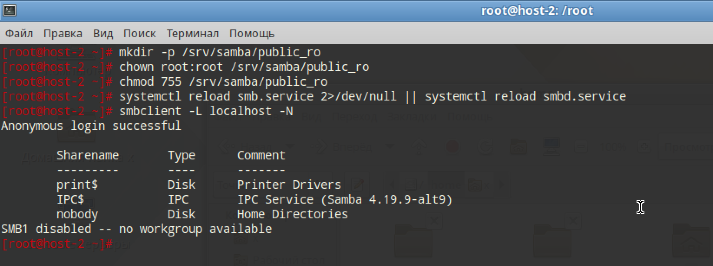
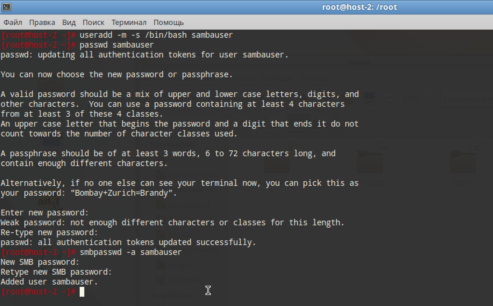
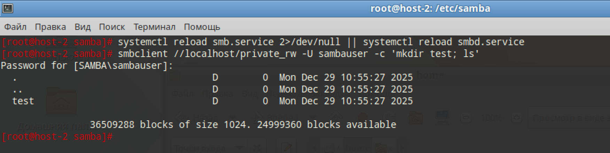

# Шарим


## 1. Установите пакет samba

```
sudo apt-get update
sudo apt-get install -y samba samba-client
```



## 2. ЧТо такое побщая папка, зачем оно может быть нужно?

Общая папка - централизованный файлообменник в локальной сети. Можно подлключить несколько машин с одной папке и передавать файлы туда-обратно с заданием прав, групп и всего вытекающего

## 3. Создайте общую папку без пароля с правами только на чтение файлов

```
mkdir -p /srv/samba/public_ro
chown root:root /srv/samba/public_ro
chmod 755 /srv/samba/public_ro

systemctl reload smb.service 2>/dev/null || systemctl reload smbd.service
smbclient -L localhost -N
```



## 4. Создайте общую папку с паролем с правами на чтение и запись

Создаю юзера и добавлю в базу Samba

```
useradd -m -s /bin/bash sambauser
passwd sambauser
smbpasswd -a sambauser
```



Расшарю папку

```
mkdir -p /srv/samba/private_rw
chown sambauser:sambauser /srv/samba/private_rw
chmod 770 /srv/samba/private_rw
```

Поменяю конфиг

```
[private_rw]
        path = /srv/samba/private_rw
        browseable = yes
        read only = no
        valid users = sambauser
        create mask = 0660
        directory mask = 0770
```

И перезагружу

```
systemctl reload smb.service 2>/dev/null || systemctl reload smbd.service
smbclient //localhost/private_rw -U sambauser -c 'mkdir test; ls'
```



## 5. Создайте общую папку с доступом для какой-то группы с полными правами

Создадим группу и добавим в неё `sambauser`

```
groupadd sambagrp
usermod -aG sambagrp sambauser

mkdir -p /srv/samba/group_fl
chown root:sambagrp /srv/samba/group_fl
chmod 2770 /srv/samba/group_fl
```

Поменяем конфиг

```
[group_fl]
        path = /srv/samba/group_fl
        browseable = yes
        read only = no
        valid users = @sambagrp
        force group = sambagrp
        create mask = 0660
        directory mask = 2770
```

Перезагрузим и проверим

```
systemctl reload smb.service 2>/dev/null || systemctl reload smbd.service
smbclient //localhost/group_fl -U sambauser -c 'put /etc/hosts hosts.copy; ls'
```

## 6. Создайте общую папку в которой у одной группы будет полный доступ, а у другой только доступ на чтение. Третья группа не должна иметь к ней доступа

Группы и пользователи

```
groupadd group_rw
groupadd group_ro
groupadd group_deny

useradd -m -s /bin/bash rwuser
useradd -m -s /bin/bash rouser
useradd -m -s /bin/bash nouser

passwd rwuser
passwd rouser
passwd nouser
```

Учётки Samba

```
smbpasswd -a rwuser
smbpasswd -a rouser
smbpasswd -a nouser
```

Участие в группах

```
usermod -aG group_rw rwuser
usermod -aG group_ro rouser
usermod -aG group_deny nouser
```

Сетевые каталоги

```
mkdir -p /srv/samba/three_groups
chown root:group_rw /srv/samba/three_groups
chmod 2770 /srv/samba/three_groups

setfacl -m g:group_ro:rx /srv/samba/three_groups
setfacl -d -m g:group_rw:rwx /srv/samba/three_groups
```

Изменение конфига

```
[shared_3groups]
      path = /srv/samba/three_groups
      browseable = yes
      # По умолчанию только чтение через Samba
      read only = yes
      # но группе group_rw разрешим запись
      write list = @group_rw
      # Доступ только двум группам. group_deny не входит
      valid users = @group_rw @group_ro
      force group = group_rw
      create mask = 0664
      directory mask = 2775
```

```
systemctl reload smb.service 2>/dev/null || systemctl reload smbd.service
```

Проверка доступа

```
smbclient //localhost/shared_3groups -U rwuser -c 'put /etc/hostname hostname.rw; ls'
smbclient //localhost/shared_3groups -U rouser -c 'ls; get hostname.rw -'
smbclient //localhost/shared_3groups -U rouser -c 'put /etc/hosts should_fail' 
smbclient //localhost/shared_3groups -U nouser -c 'ls'
```