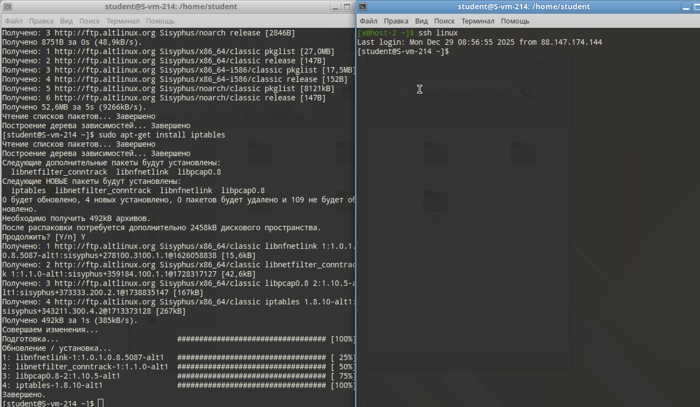
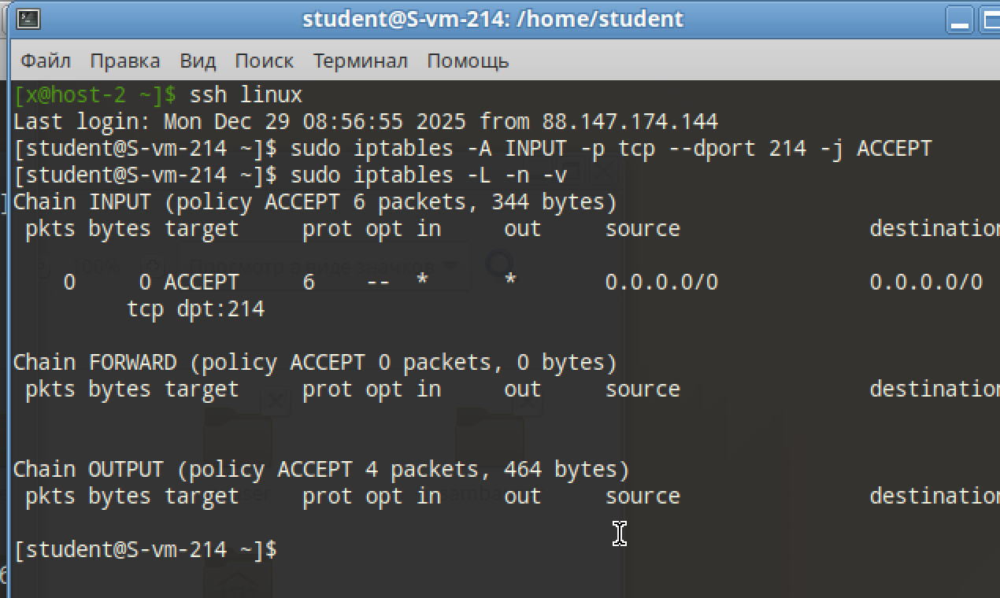
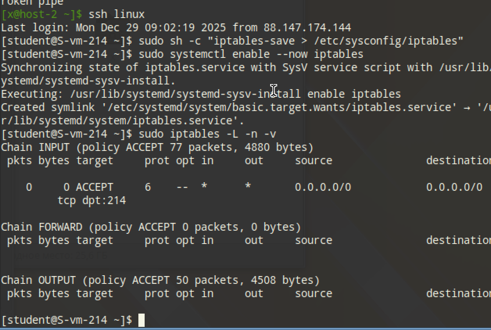

# Открываем iptables

## 1. Установите iptables

```
sudo apt-get update
sudo apt-get install iptables
```

## 2. Проверьте осталась ли возможность подключения по ssh к вашему серверу

```
ssh linux
```

Всё работает!



## 3. Почему может пропасть такая возможность?

Будет стоять правило, что для всех входящих пакетов будет применена политика `DROP` (сброс соединения), или `REJECT` (отклонение). Но не будет правила для порта SSH

И при кривой установке iptables есть риск ~~про*****~~ потерять возможность подключиться по SSH к серверу, и придётся ехать в ночь в офис, если нет KVM

## 4. Откройте нужный порт на сервере чтобы восстановить подключение

```
sudo iptables -A INPUT -p tcp --dport 214 -j ACCEPT
```

По флагам:

-A INPUT: это правило для ВХОДЯЩИХ подключений
-p tcp: протокол TCP
--dport 214: порт назначения
-j ACCEPT: задача - принимать входящий пакет 


Проверить правила можно этой командой

```
sudo iptables -L -n -v
```



## 5. Это будет udp или tcp прот?

SSH всегда работает по TCP. Нам ведь надо последовательное отправление пакетов. Да и в правиле `-p` указан TCP по этой причине

# Сохраняем

## 6. Сохраняются ли записанные вами правила после перезагрузки?

Вспоминая слова о кривой установке и возможности потерять доступ к серверу - защита от дурака есть. Изменения есть только в текущей сессии ядра. При перезагрузке всё возвращается на стандартные позиции

## 7. Как их сохранить?

Надо записать правила (которые находятся в `sudo iptables -L -n -v`) в конфиг.

```
sudo sh -c "iptables-save > /etc/sysconfig/iptables"
```

И включаем это правило, чтобы была их загрузка при старте системы

```
sudo systemctl enable --now iptables
```

