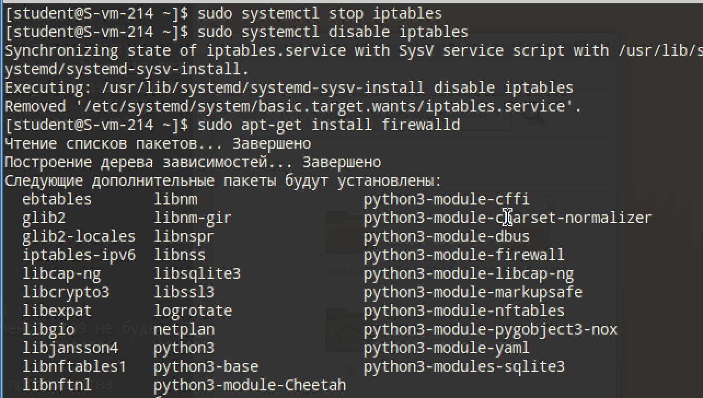
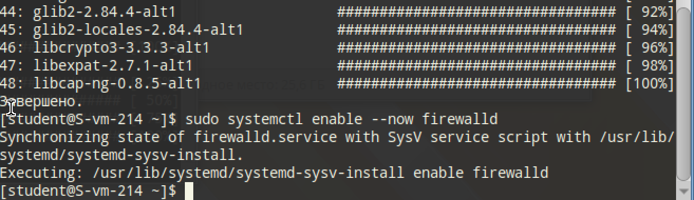
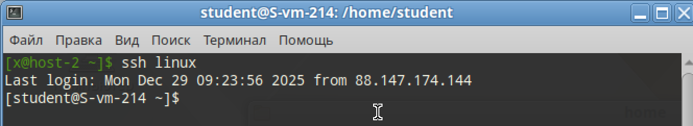
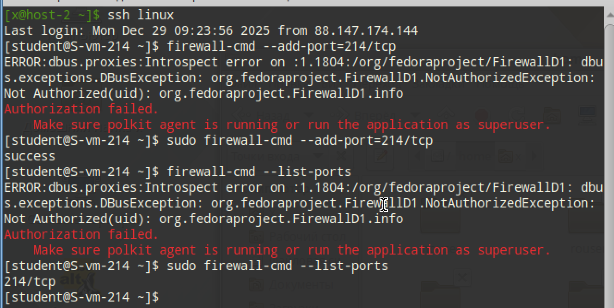
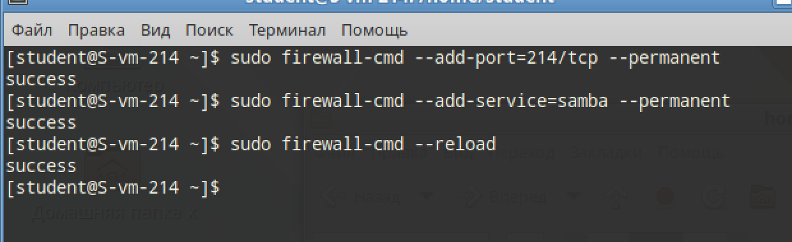

# Открываем firewald

## 1. Удалите iptables и установите firewalld

Останавливаем и выключаем 

```
sudo systemctl stop iptables
sudo systemctl disable iptables
```



Ставим `firewalld` и запускаем

```
sudo apt-get install firewalld
sudo systemctl enable --now firewalld
```



## 2. Попробуйте так-же проверить возможность подключения по ssh

Повезло-повезло. Подключение подключилось



## 3. Если её нет то откройте порт. 4. И Выведите список открытых портов с помощью firewall-cmd

Для перестраховки открою

```
firewall-cmd --add-port=214/tcp
```

И посмотрим

```
firewall-cmd --list-ports
```



## 5. Можно ли там добавить порты по названию сервиса?

Конечно! Вместо запоминания того, что SSH - 22 порт, можно просто ввести `firewall-cmd --add-service=ssh`

Список всех сервисов получается этой командой: `firewall-cmd --get-services`

## 6. На вашей Локальной виртуальной машине попробуйте подключиться к серверу samba из предыдущих заданий. 7. Если не получилось то откройте нужные порты

Сначала открываем порт для Samba

```
sudo firewall-cmd --add-service=samba
```

## 9. Сделайте так чтобы изменения были постоянными

Для удалённых подключений:

```
sudo firewall-cmd --add-port=214/tcp --permanent
```

Для локальных:

```
sudo firewall-cmd --add-service=samba --permanent
```

И перезагружаем

```
sudo firewall-cmd --reload
```



